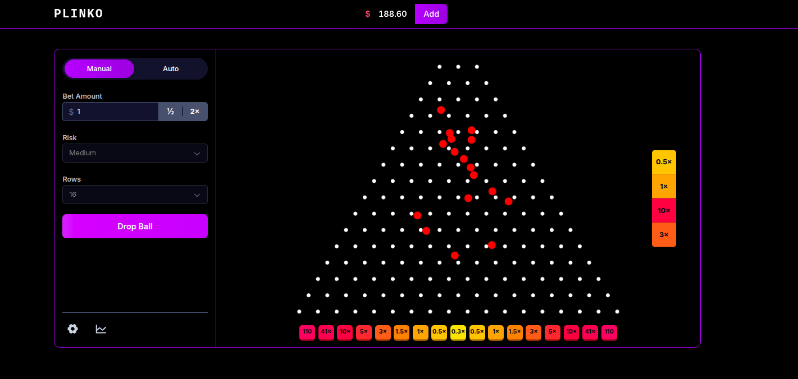

# Plinko Game

A simple gambling game built to explore Svelte 5, Tailwind CSS, and matter-js. Drop balls through a field of pins and land in multiplier bins. 



## Tech Stack

- Svelte 5 + TypeScript
- Vite (dev/build)
- Tailwind CSS v4
- matter-js (physics)


## Features

- Manual and Auto bet modes
- Live stats (profit and recent wins)
- Responsive layout

## Setup

Requires Node.js 20+

```bash
# install deps (use legacy peer deps to avoid lints' peer conflicts)
npm install --legacy-peer-deps

# start dev server
npm run dev
```

Open `http://localhost:5173/` in your browser.

## Build

```bash
npm run build
# optional: preview the production build locally
npm run preview
```

## How this differs from real gambling sites

This project runs entirely on the client in your browser and uses `matter-js` to simulate physics. That has a few important consequences compared to real-money gambling platforms:

- Outcomes are not pre-determined: because the ball physics are simulated client-side, the result is unknown until the ball actually lands in a bin. There is no server deciding the final bin beforehand or forcing the ball toward a target bin.
- Client-side physics vs server-side outcome: many real platforms compute the result on a back-end service and then render an animation that leads to that precomputed result. Here, the simulation itself produces the outcome.
- Return can fluctuate around expectations: due to physics randomness, the observed average return can sometimes exceed the expected value over short or medium samples. In real gambling, a house edge ensures the expected return is always below 1. Keeping payouts identical to popular tables is for familiarity, not for profitability.

This is a learning project and free-to-play simulation, not a gambling product.


